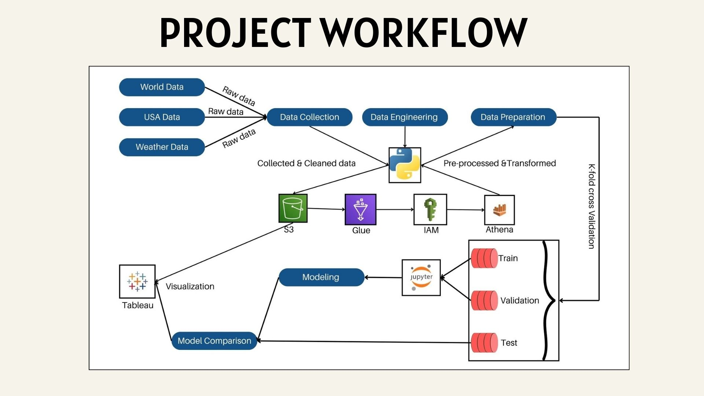
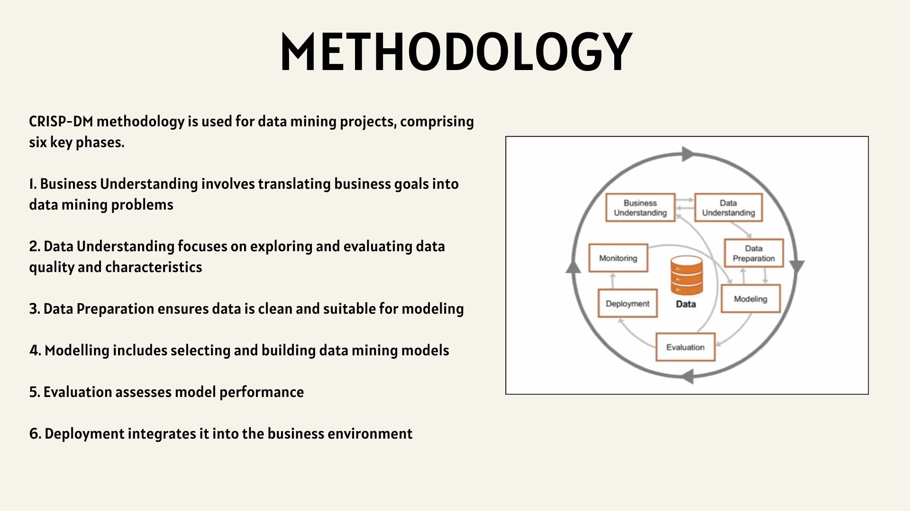
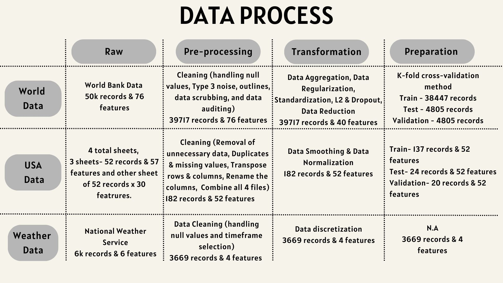
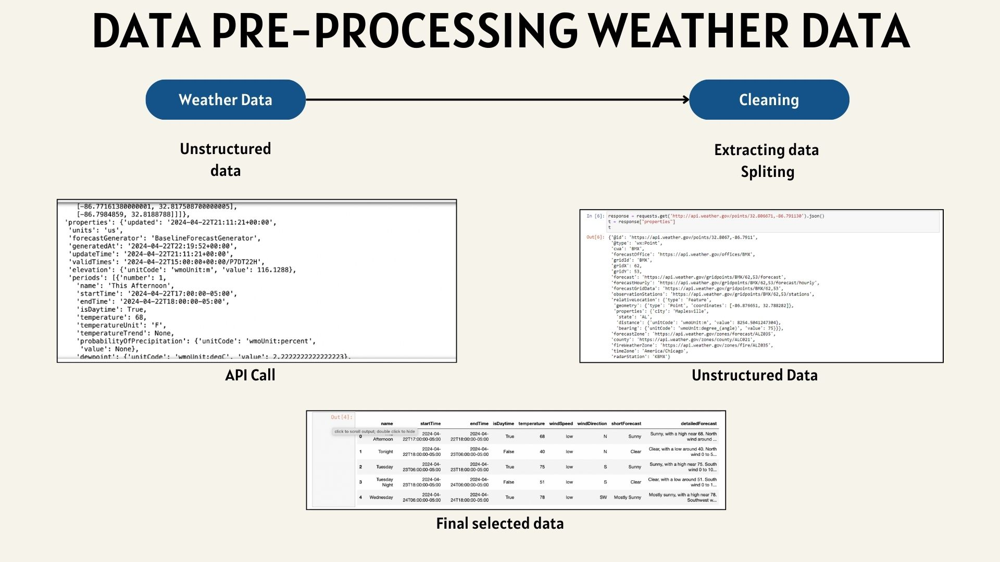
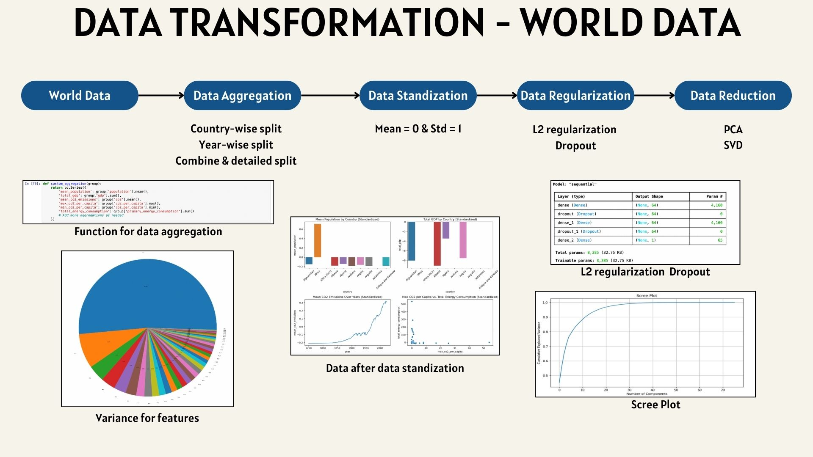
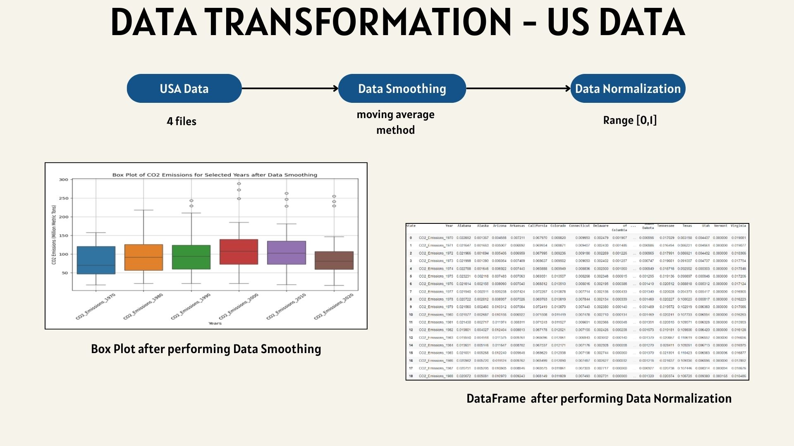
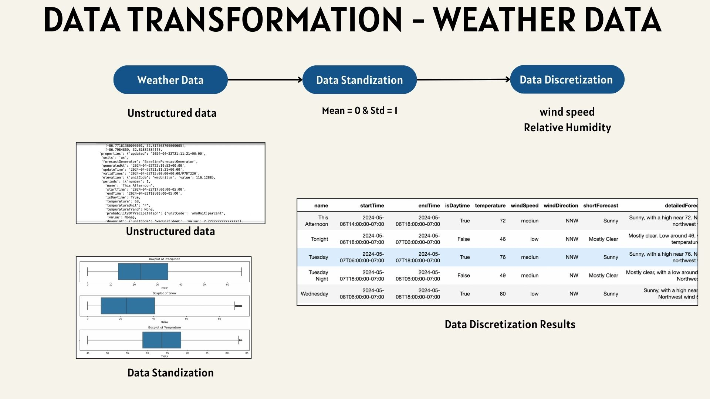
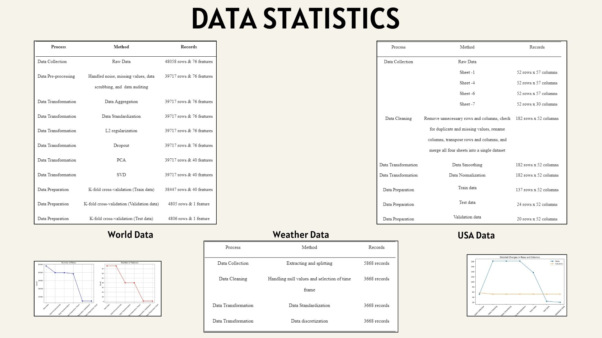

# Unveiling the Future of Carbon Emissions Trading

## Project Overview
This project explores the use of Machine Learning (ML) and Neural Networks (specifically Hybrid CNN-ANN models) to forecast carbon emissions across various sectors and regional markets. It aims to help policymakers and researchers analyze future carbon emissions trends, evaluate the effectiveness of current policies, and devise strategies for sustainable development.

## Objective
The goal of this project is to develop a predictive model using Hybrid CNN-ANN to:
- Forecast carbon dioxide emissions from historical data.
- Evaluate policy interventions and economic factors.
- Facilitate real-time predictions across various sectors.

## Workflow

### Project Workflow

### Methodology

### Data Process

### Data Pre-processing

### Data Transformation - World Data

### Data Transformation - US Data

### Data Transformation - Weather Data

### Data Statistics

## Data Sources
- **World Data**: 50k records with 76 features
- **USA Data**: 182 records and 52 features (pre-processed)
- **Weather Data**: 6k records and 6 features (pre-processed)

## Model Development
### CNN-ANN Hybrid Architecture
This model leverages the power of Convolutional Neural Networks (CNN) for feature extraction and Artificial Neural Networks (ANN) for learning complex relationships between features. The hybrid model combines the strengths of both CNN and ANN, allowing for high accuracy in predicting emissions.

**Performance Metrics**:
- **MSE (Mean Squared Error)**: Measures average squared error.
- **MAE (Mean Absolute Error)**: Measures average absolute error.
- **R-Squared**: Represents how close the data is to the fitted regression line.

## Tools and Technologies
- **Python Libraries**: TensorFlow, Keras, Scikit-Learn, Pandas, NumPy, Matplotlib, Seaborn.
- **AWS Infrastructure**: S3 for storage, Glue for ETL, Athena for querying.
- **Jupyter Notebooks**: For interactive coding and data analysis.
- **Tableau**: Visualization and model comparison.

## Model Comparison
Several machine learning models were tested:
- Linear Regression
- Decision Tree
- Random Forest
- K-Nearest Neighbors
- ANN
- Hybrid CNN-ANN

The Hybrid CNN-ANN model outperformed the others with an MSE of 0.0121, MAE of 0.0279, and an R-squared value of 0.99962, making it the most suitable model for predicting future emissions.

## Environment Setup
- **Anaconda**: Python environment management.
- **AWS S3 & Glue**: Data storage and ETL.
- **AWS Athena**: Querying and analyzing data.
- **Google Colab**: Code sharing and team collaboration.
- **GitHub**: Version control for the project.
- **JIRA**: Project management and roadmap planning.
